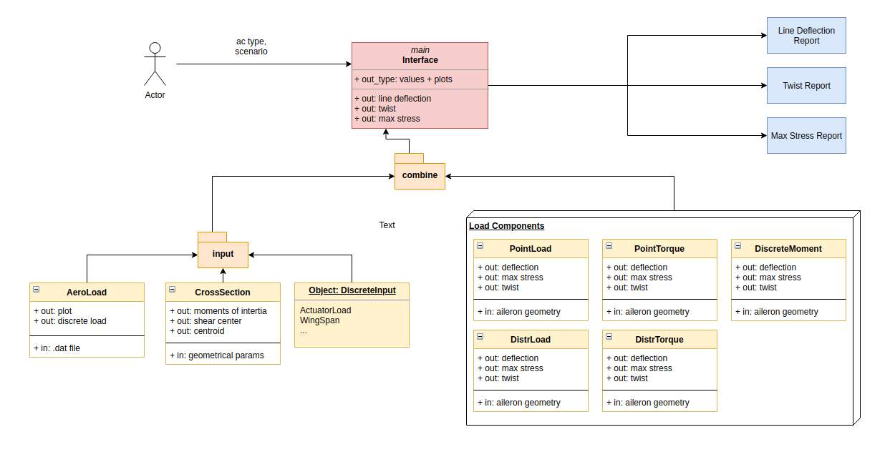

# SVV-Group-13-TUDelft

The code will output the following of the chosen aircraft type:

- cross section
- aerodynamic load distribution
- point reaction loads
- twist of aileron
- deflection of aileron
- Von Mises stress along aileron

The sctructure of the code can be summarized in the diagram below. 

## Usage

The script can be launched from the `/src` folder by typing `python3 main.py` in the terminal command. The user will be asked for aircraft type, then the information retreival and plotting will start. 

## Unit Tests

Unit tests can be run altogether by typing `source /tests/run_tests.bash` in the command prompt.

## Jupyter Notebook

A Jupyter Notebook can be inspectioned as well in folder `/notebook`. It contains the same process, but developed in a linear, non object-oriented way. 

